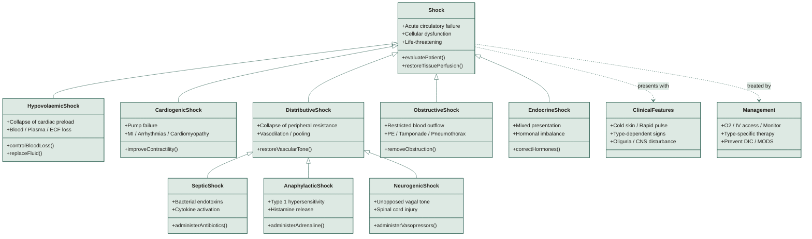

Detailed mindmap on shock

#### CLASS DIAGRAM

```mermaid
%%{init: {'theme':'base', 'themeVariables': {
  'primaryColor':'#dde9e3',
  'primaryBorderColor':'#356559',
  'primaryTextColor':'#24221e',
  'lineColor':'#356559',
  'fontFamily':'Inter, sans-serif'
}}}%%
classDiagram
    class Shock {
        +Acute circulatory failure
        +Cellular dysfunction
        +Life-threatening
        +evaluatePatient()
        +restoreTissuePerfusion()
    }

    class HypovolaemicShock {
        +Collapse of cardiac preload
        +Blood / Plasma / ECF loss
        +controlBloodLoss()
        +replaceFluid()
    }

    class CardiogenicShock {
        +Pump failure
        +MI / Arrhythmias / Cardiomyopathy
        +improveContractility()
    }

    class DistributiveShock {
        +Collapse of peripheral resistance
        +Vasodilation / pooling
        +restoreVascularTone()
    }

    class ObstructiveShock {
        +Restricted blood outflow
        +PE / Tamponade / Pneumothorax
        +removeObstruction()
    }

    class EndocrineShock {
        +Mixed presentation
        +Hormonal imbalance
        +correctHormones()
    }

    class SepticShock {
        +Bacterial endotoxins
        +Cytokine activation
        +administerAntibiotics()
    }

    class AnaphylacticShock {
        +Type 1 hypersensitivity
        +Histamine release
        +administerAdrenaline()
    }

    class NeurogenicShock {
        +Unopposed vagal tone
        +Spinal cord injury
        +administerVasopressors()
    }

    class ClinicalFeatures {
        +Cold skin / Rapid pulse
        +Type-dependent signs
        +Oliguria / CNS disturbance
    }

    class Management {
        +O2 / IV access / Monitor
        +Type-specific therapy
        +Prevent DIC / MODS
    }

    Shock <|-- HypovolaemicShock
    Shock <|-- CardiogenicShock
    Shock <|-- DistributiveShock
    Shock <|-- ObstructiveShock
    Shock <|-- EndocrineShock

    DistributiveShock <|-- SepticShock
    DistributiveShock <|-- AnaphylacticShock
    DistributiveShock <|-- NeurogenicShock

    Shock ..> ClinicalFeatures : presents with
    Shock ..> Management : treated by
```

#### FLOW CHART

```mermaid
%%{init: {'theme':'base', 'themeVariables': {
  'primaryColor':'#dde9e3',
  'primaryBorderColor':'#356559',
  'primaryTextColor':'#24221e',
  'lineColor':'#356559',
  'fontFamily':'Inter, sans-serif',
  'fontSize':'14px'
}}}%%
flowchart LR
    %% Main Shock Overview
    SHOCK[SHOCK<br>Acute circulatory failure compromising tissue perfusion] --> INTRODUCTION
    SHOCK --> TYPES
    SHOCK --> CLINICAL
    SHOCK --> INVESTIGATIONS
    SHOCK --> MANAGEMENT

    %% Introduction Section
    INTRODUCTION[Introduction] --> DEF[Definition: Acute circulatory failure<br>compromising tissue perfusion]
    INTRODUCTION --> MANIFEST[Manifestation of cellular<br>dysfunction due to inadequate perfusion]
    INTRODUCTION --> THREAT[Life-threatening: progresses to<br>irreversible damage if untreated]

    %% Types of Shock Section
    TYPES[Types of Shock] --> HYPO[Hypovolaemic Shock]
    TYPES --> CARDIO[Cardiogenic Shock]
    TYPES --> DISTRIB[Distributive Shock]
    TYPES --> OBSTRUCT[Obstructive Shock]
    TYPES --> ENDO[Endocrine Shock]

    %% Hypovolaemic Shock
    HYPO --> HYPO_DEF[Definition: Collapse of cardiac<br>preload due to reduced volume]
    HYPO --> HYPO_CAUSES[Causes]
    HYPO --> HYPO_PATH[Pathophysiology]

    HYPO_CAUSES --> BLOOD_LOSS[Blood Loss]
    BLOOD_LOSS --> INTERNAL[Internal hemorrhage]
    BLOOD_LOSS --> EXTERNAL[External hemorrhage]
    
    HYPO_CAUSES --> PLASMA_LOSS[Loss of Plasma]
    PLASMA_LOSS --> BURNS[Extensive burns]
    PLASMA_LOSS --> PERITONITIS[Peritonitis]
    
    HYPO_CAUSES --> ECF_LOSS[Loss of Extracellular Fluid]
    ECF_LOSS --> OBSTRUCTION[Intestinal obstruction]
    ECF_LOSS --> DIARRHEA[Diarrhea and vomiting]
    
    HYPO_CAUSES --> INTERSTITIAL[Massive fluid loss into<br>interstitial tissues]
    INTERSTITIAL --> SEPSIS_CAUSE[Sepsis]
    INTERSTITIAL --> PANCREATITIS[Acute pancreatitis]

    HYPO_PATH --> EARLY[Early Stage]
    EARLY --> REDUCED_VOL[Reduced circulating volume]
    EARLY --> BARO[Baroreceptor response]
    EARLY --> ADRENAL[Adrenal-sympathetic stimulation]
    EARLY --> CATECHOLAMINES[Adrenaline/Noradrenaline release]
    EARLY --> INCREASED_HR[Increased heart rate and vasoconstriction]
    
    HYPO_PATH --> MIDDLE[Middle Stage]
    MIDDLE --> OVERACTIVITY[Continued sympathetic overactivity]
    MIDDLE --> RAAS[Activation of RAAS]
    MIDDLE --> SPLANCHNIC[Splanchnic vasoconstriction]
    MIDDLE --> BACT_TRANS[Bacterial translocation]
    MIDDLE --> ANAEROBIC[Anaerobic respiration and lactic acidosis]
    
    HYPO_PATH --> LATE[Late Stage]
    LATE --> COMP_FAIL[Compensatory mechanisms fail]
    LATE --> ENDOTHELIUM[Capillary endothelium damage]
    LATE --> CEREBRAL_DEC[Decreased cerebral blood flow]
    LATE --> PROG_DYSF[Progressive cerebral dysfunction]

    %% Cardiogenic Shock
    CARDIO --> CARDIO_DEF[Definition: Pump failure;<br>ventricles fail to pump sufficiently]
    CARDIO --> CARDIO_CAUSES[Causes]
    
    CARDIO_CAUSES --> MI[Acute Myocardial Infarction]
    CARDIO_CAUSES --> ARRHYTHMIA[Arrhythmias]
    CARDIO_CAUSES --> CARDIOMYOPATHY[Cardiomyopathies]
    CARDIO_CAUSES --> VALVE[Heart valve problems]
    CARDIO_CAUSES --> MECHANICAL[Mechanical factors]

    %% Distributive Shock
    DISTRIB --> DISTRIB_DEF[Definition: Collapse of<br>peripheral resistance]
    DISTRIB --> DISTRIB_MECH[Mechanisms]
    DISTRIB --> DISTRIB_TYPES[Subtypes]
    
    DISTRIB_MECH --> VASODIL[Vasodilation of arterioles & venules]
    DISTRIB_MECH --> POOLING[Peripheral pooling]
    
    DISTRIB_TYPES --> SEPTIC[Septic Shock]
    SEPTIC --> ENDOTOXINS[Bacterial endotoxins]
    SEPTIC --> CYTOKINES[Cytokine activation]
    SEPTIC --> ENDO_DAMAGE[Endothelial damage]
    
    DISTRIB_TYPES --> ANAPHYLACTIC[Anaphylactic Shock]
    ANAPHYLACTIC --> HYPERSENSITIVITY[Type 1 hypersensitivity reaction]
    ANAPHYLACTIC --> HISTAMINE[Histamine/vasoactive amine release]
    
    DISTRIB_TYPES --> NEUROGENIC[Neurogenic Shock]
    NEUROGENIC --> VAGAL[Unopposed vagal tone]
    NEUROGENIC --> SPINAL[Cervical spinal cord injury]

    %% Obstructive Shock
    OBSTRUCT --> OBSTRUCT_DEF[Definition: Physical restriction<br>to blood outflow]
    OBSTRUCT --> OBSTRUCT_CAUSES[Causes]
    
    OBSTRUCT_CAUSES --> PE[Pulmonary embolism]
    OBSTRUCT_CAUSES --> TAMPONADE[Cardiac tamponade]
    OBSTRUCT_CAUSES --> PNEUMO[Tension pneumothorax]

    %% Endocrine Shock
    ENDO --> ENDO_DEF[Combination of hypovolaemic,<br>cardiogenic, and distributive shock]
    ENDO --> ENDO_CAUSES[Causes: Hormonal imbalances]

    %% Clinical Features
    CLINICAL[Clinical Features] --> GEN_FEATURES[General Features]
    GEN_FEATURES --> COLD_SKIN[Cold, white, clammy patient]
    GEN_FEATURES --> RAPID_PULSE[Rapid thready pulse]
    GEN_FEATURES --> INC_RESP[Increased respiratory rate]
    
    CLINICAL --> BP_DROP[Fall in arterial BP]
    CLINICAL --> OLIGURIA[Reduced urinary output]
    
    CLINICAL --> SEPTIC_UNIQUE[Septic Shock contrast]
    SEPTIC_UNIQUE --> HOT_SKIN[Hot, flushed skin]
    SEPTIC_UNIQUE --> BOUNDING[Bounding pulse]
    
    CLINICAL --> SEVERE_SIGNS[Severe Signs]
    SEVERE_SIGNS --> WEAK_PULSE[Weak, thready pulse]
    SEVERE_SIGNS --> COLD_PERIPHERY[Cold, clammy skin]
    SEVERE_SIGNS --> COLLAPSED_VEINS[Collapsed peripheral veins]
    SEVERE_SIGNS --> TACHYPNEA[Rapid respiration]
    SEVERE_SIGNS --> CNS_DISTURB[CNS disturbances]
    SEVERE_SIGNS --> ANURIA[Oliguria or anuria]

    %% Investigations
    INVESTIGATIONS --> HB[Baseline hemoglobin/hematocrit]
    INVESTIGATIONS --> GROUP[Blood grouping and cross-matching]
    INVESTIGATIONS --> ELECTROLYTES[Serum electrolytes, urea, creatinine]
    INVESTIGATIONS --> ABG[Arterial blood gases]
    INVESTIGATIONS --> LACTATE[Serum lactate]
    INVESTIGATIONS --> GLUCOSE[Blood glucose]
    INVESTIGATIONS --> CULTURES[Blood cultures]

    %% Management
    MANAGEMENT[Management] --> AIM[Aim: Restore tissue perfusion and oxygenation]
    MANAGEMENT --> GEN_STEPS[General Steps]
    MANAGEMENT --> SPEC_TREAT[Specific Treatment]
    MANAGEMENT --> COMP[Complications]
    
    GEN_STEPS --> O2[Oxygen therapy]
    GEN_STEPS --> IV_ACCESS[Venous access and fluid resuscitation]
    GEN_STEPS --> MONITOR[Continuous assessment]
    GEN_STEPS --> PRIMARY[Treat primary problem]
    
    SPEC_TREAT --> TREAT_HYPO[Hypovolaemic Shock Treatment]
    TREAT_HYPO --> ID_CAUSE[Identify cause of fluid loss]
    TREAT_HYPO --> CONTROL_BLEED[Control blood loss]
    TREAT_HYPO --> FLUID_REPLACE[Fluid replacement]
    
    SPEC_TREAT --> TREAT_CARDIO[Cardiogenic Shock Treatment]
    TREAT_CARDIO --> FLUID_CAREFUL[Cautious fluid resuscitation]
    TREAT_CARDIO --> INOTROPES[Improve myocardial contractility]
    TREAT_CARDIO --> TREAT_UNDERLYING[Treat underlying pathology]
    
    SPEC_TREAT --> TREAT_ANAPH[Anaphylactic Shock Treatment]
    TREAT_ANAPH --> ADRENALINE[Adrenaline]
    TREAT_ANAPH --> STEROIDS[Hydrocortisone & Chlorpheniramine]  
    TREAT_ANAPH --> FLUID_IV[IV fluids]
    
    SPEC_TREAT --> TREAT_NEURO[Neurogenic Shock Treatment]
    TREAT_NEURO --> AIRWAY[Secure airway]
    TREAT_NEURO --> FLUID_NEURO[Fluid resuscitation]
    TREAT_NEURO --> PRESSORS[Vasoconstrictors if needed]
    
    SPEC_TREAT --> TREAT_SEPTIC[Septic Shock Treatment]
    TREAT_SEPTIC --> FLUID_SEPTIC[Adequate fluid resuscitation]
    TREAT_SEPTIC --> ANTIBIOTICS[Appropriate antibiotics]
    TREAT_SEPTIC --> SURGICAL[Surgical elimination of infection source]
    
    COMP --> DIC[Disseminated Intravascular Coagulation]
    COMP --> MODS[Multiple Organ Dysfunction Syndrome]

    %% Style classes
    classDef default fill:#f9f9f9,stroke:#333,stroke-width:1px;
    classDef main fill:#d4f1f9,stroke:#333,stroke-width:2px,font-weight:bold;
    classDef section fill:#e6f3ff,stroke:#333,stroke-width:1.5px,font-weight:bold;
    classDef subsection fill:#f0f7fb,stroke:#333,stroke-width:1px;
    
    %% Apply styles
    class SHOCK main;
    class INTRODUCTION,TYPES,CLINICAL,INVESTIGATIONS,MANAGEMENT section;
    class HYPO,CARDIO,DISTRIB,OBSTRUCT,ENDO,GEN_FEATURES,SEVERE_SIGNS,SEPTIC_UNIQUE,GEN_STEPS,SPEC_TREAT,COMP subsection;
```
